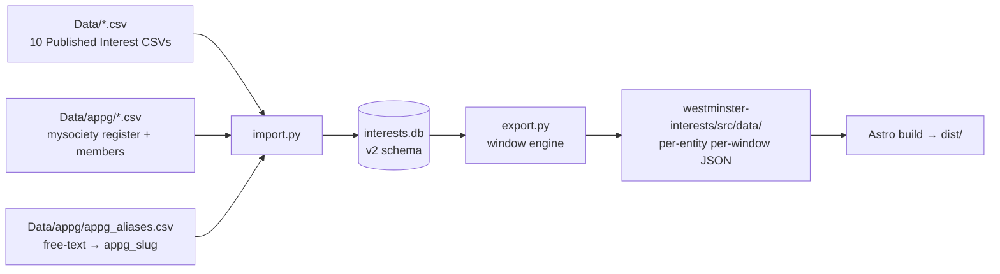

# feat: Rebuild as Westminster Interests

## Overview

Rebuild the UK Parliamentary financial-interests site from scratch with a new identity ("Westminster Interests"), new UI system (Starwind UI on Astro v6 + Tailwind v4), and expanded data pipeline (per-entity/per-window JSON tree, APPG reference model, parliament.uk source links). The existing [astro/](astro/) site is preserved in-repo for reference and replaced at launch.

Supersedes the satirical wrap of "The Westminster 100". Same underlying [interests.db](import.py) SQLite source, new export shape, new routes, new voice.

## Problem Frame

The current site ([astro/](astro/)) ships as a satirical "Westminster 100" leaderboard. That framing no longer serves the intended audience — journalists and researchers who need a neutral, citable, full-register reference work. The data pipeline is mature but produces a flat 12-month JSON shape that can't support multiple date windows, APPG browsing, or per-row source citations. The rebuild retargets the product, the UI, and the data shape in one coordinated cut.

Origin doc: [westminster-interests-rebuild-requirements.md](docs/brainstorms/westminster-interests-rebuild-requirements.md) — contains full identity/voice, IA, time model, and a Phase 1.3 technical design section (data storage, rendering, schema) that this plan executes against.

## Requirements Trace

- **R1.** Neutral reference-work voice; no retained satirical terminology (origin §Identity, §Success criteria).
- **R2.** Full-register IA — Members / Payers / Parties / APPGs / Methodology with detail pages at `/member/[mnis_id]`, `/payer/[id]`, `/party/[slug]`, `/appg/[slug]` (origin §Information architecture).
- **R3.** Six selectable date windows — trailing 12m (default), YTD, 2025, 2024, since 2024 general election, all-time — URL-persistent, client-side swap (origin §Time model).
- **R4.** Every payment row carries a parliament.uk source link (origin §Key capabilities §2).
- **R5.** APPG browsing (index + detail), backed by a canonical APPG reference model with alias mapping (origin §Key capabilities §3).
- **R6.** Methodology page covering sources, window logic, pro-rata rules, caveats, "as of" stamp (origin §Key capabilities §1).
- **R7.** Starwind UI on Astro v6 + Tailwind v4; monochrome + single civic-blue accent; dark mode included (origin §Visual & design system, updated per user input 2026-04-18 to include dark mode).
- **R8.** Per-entity, per-window JSON tree under `src/data/` drives the site; no runtime DB (origin §Technical design §1).
- **R9.** TypeScript types one module per entity; `tsc` catches exporter/reader drift (origin §Technical design §3).
- **R10.** Old `astro/` preserved in-repo for reference until launch swap (origin §Non-goals).

## Scope Boundaries

- No satirical copy, puns, or editorial framing anywhere on the site (origin §Non-goals).
- No CSV/JSON download surface in v1 (origin §Non-goals, §Out of scope).
- No user accounts, saved searches, alerts, live rebuilds, visualisation-heavy features (origin §Out of scope).
- No party colours in the UI — tags only (origin §Visual & design system).
- No runtime database; static build only (origin §Non-goals).
- No explicit accessibility audit in v1; sensible defaults only (origin §Out of scope).

### Deferred to Separate Tasks

- **CSV/JSON download surface:** deferred to a follow-up once the site is stable.
- **Chart library selection:** gated on the open question "do we need charts at all?" — start tables-only.
- **Per-build snapshot archive (`docs/snapshots/`):** retention policy deferred; v1 relies on live `meta.json` for citations.
- **Old `astro/` directory deletion:** kept in-repo during v1 launch; cleanup is a later task.

## Context & Research

### Relevant Code and Patterns

- **Data pipeline (Python):**
  - [import.py](import.py) — CSV → SQLite ingest; payer dedup; Cat 4 multi-donor flattening; captures free-text `payments.appg`. Hardcoded paths: `DATA_DIR = Path(__file__).parent / "Data"`, `DB_PATH = "interests.db"`.
  - [export.py](export.py) — emits flat JSON to `astro/src/data/`. Currently writes `individuals.json`, `parties.json`, `donors.json`, `philanthropists.json`, `payments_detail.json`, `meta.json`. 12m pro-rata window logic at [export.py:49-75](export.py#L49-L75). Already supports `--as-of` and `--output-dir` flags.
  - [schema.sql](schema.sql) — `members`, `payers`, `interests`, `payments` + `payments_full` view. `payments.appg` is free text (159 rows populated).
  - [rebuild_master.py](rebuild_master.py) — payer canonicalisation (`payers_master`, `payers_master_map`); optional, used by export.py if present.

- **APPG source (mysociety dataset):** [appg_groups_and_memberships.xlsx](appg_groups_and_memberships.xlsx) at repo root. Sheets:
  - `register` (930 rows) — authoritative APPG metadata: slug, title, purpose, categories, source_url, secretariat, website, AGM date, registered contact. Includes `parliament` field with values `{uk, ni-assembly, scottish-parliament, senedd-cy, senedd-en}` — we filter to `uk` only.
  - `members` (13,293 rows) — APPG memberships with `mnis_id`, `officer_role`, `is_officer`, `member_type` (mp/lord), `url_source`.
  - `categories` (1,390 rows) — appg_slug → category_slug mapping (many-to-many; APPGs often span 1–2 categories).

- **Existing Astro site:** [astro/package.json](astro/package.json) — Astro 6.1.4, MDX 5, Sitemap 3.7, Pagefind 1.4 (postbuild script). **No** Tailwind, Grid.js, Starwind installed. [astro/src/pages/](astro/src/pages/) has `index`, `mp/[id]`, `patron/[id]`, `donors`, `philanthropists`, `parties`, `party/[name]`. Components in [astro/src/components/](astro/src/components/) include `BaseHead`, `BaseLayout`, `Header`, `Footer`, `FormattedDate`, `Search` (Pagefind).

- **Legacy `site/` directory:** hand-rolled static HTML from pre-Astro era. Not live; ignore for the rebuild.

### Institutional Learnings

- No `docs/solutions/` directory exists yet. No prior compound learnings to consult.

### External References

- **Starwind UI:** `pnpx starwind@latest init` to bootstrap, `pnpx starwind@latest add <component>` per component. Works on Astro v6 + Tailwind v4. Uses `--starwind-*` CSS custom properties (e.g. `--starwind-accordion-content-height`).
- **mysociety APPG dataset:** https://pages.mysociety.org/appg_membership — authoritative source for the xlsx.
- **Parliament register source:** https://interests.parliament.uk/ — per-payment link pattern still to confirm against real URLs during Unit 3.

## Key Technical Decisions

- **New site lives in a new directory [westminster-interests/](westminster-interests/), not in-place over [astro/](astro/).** The old site is preserved for reference through the rebuild; at launch the new directory is swapped into production.
- **Breaking changes to [export.py](export.py) are fine.** The old [astro/](astro/) site is not maintained in parallel — Unit 4 rewrites `export.py` without retaining a legacy-shape flag. Old site becomes a frozen reference snapshot; at launch the new site replaces it.
- **APPG data model is seeded from the mysociety xlsx, not ad-hoc aliases.** The register sheet (filtered to `parliament = 'uk'`) is the canonical APPG list. Payment-side free-text strings map onto the canonical list via a hand-maintained aliases file. Gives us real APPG detail pages (purpose, officers, members, website).
- **APPG memberships are surfaced on MP detail pages** (scope expansion confirmed 2026-04-18). Using the xlsx `members` sheet, each `/member/[mnis_id]` page lists APPGs the MP is a member of (with officer role where applicable).
- **Charitable / donated-onwards payments are not visually separated** (confirmed 2026-04-18). Origin doc had already retired the standalone "Philanthropists" page; this plan also drops the `is_donated` filter chip and row badge. All payments render as one bulk; `is_donated` stays in JSON for data fidelity and is mentioned in methodology prose as a caveat, but not as a UI affordance.
- **Single nested `totals` block per entity; one JSON file per entity carries all 6 windows.** Window swap is a client-side key lookup (`totals['12m']`, `totals['ytd']`, …). No per-window fetch. (origin §Technical design §1)
- **Parliament.uk source URL pattern (confirmed 2026-04-18):** `https://members.parliament.uk/member/{mnis_id}/registeredinterests?categoryId={categoryId}`. Reconstructible from `(mnis_id, category)` at export time — no ingest-side capture needed. Our schema categories `'1.1'` and `'1.2'` both map to URL `categoryId=1`; `'2'`→`2`, `'3'`→`3`, `'4'`→`4`, `'5'`→`5`. Each payment's citation link points to the MP's category-view containing that row (not a row-level anchor, which parliament.uk doesn't expose).
- **MP photo source (confirmed 2026-04-18):** `https://members-api.parliament.uk/api/Members/{mnis_id}/Thumbnail`. Direct URL template, no scraping, no local asset storage.
- **No-JS progressive enhancement via Grid.js `fromHTML`** (confirmed 2026-04-18). Each table page renders a full static HTML `<table>` at build time (all rows, default-window view, pre-sorted). Grid.js mounts over the existing DOM via `fromHTML: true` to add sort/filter/pagination. One source of truth (the SSR'd table), Grid.js enhances. No-JS users get a readable (unsorted) table; JS users get interactivity.
- **Theme: Starwind Lavender** (confirmed 2026-04-18). Paid Starwind theme pack; supersedes the Tailwind CSS block originally shared. Dark mode, typography, and spacing scale come from the Lavender theme bundle. Pivots accent from origin-doc's blue civic to lavender — see Risks for contrast/authority-voice check.
- **Starwind UI Pro composition blocks** (confirmed 2026-04-18) for rich page layouts (e.g. profile-02 pattern for MP hero). Starwind Pro subscription required. Hand-rolled dense payment tables for information density — Starwind table primitives are card-oriented.
- **Dark mode ships v1.** Starwind Lavender includes a dark variant. Resolves origin open question §1.
- **Old URLs 301 to new paths.** `/mp/[mnis_id]` → `/member/[mnis_id]`, `/patron/[id]` → `/payer/[id]`.
- **No runtime validation of JSON (zod etc.).** TypeScript types at read-site + `tsc` is sufficient drift detection — the Python exporter is the only producer.
- **`export.py` targets the new site's data directory.** Default `--output-dir westminster-interests/src/data`.

## Open Questions

### Resolved During Planning

- **Parliament.uk source URL pattern?** → Confirmed (2026-04-18): `https://members.parliament.uk/member/{mnis_id}/registeredinterests?categoryId={categoryId}`. Reconstructible from `(mnis_id, category)`; schema `'1.1'`/`'1.2'` → URL `categoryId=1`.
- **MP photo source?** → Confirmed (2026-04-18): `https://members-api.parliament.uk/api/Members/{mnis_id}/Thumbnail`. Hot-linked; no local asset pipeline.
- **Dark mode in v1?** → Ship. Starwind Lavender includes a `.dark` variant.
- **Accent / theme?** → Starwind Lavender (confirmed 2026-04-18). Supersedes the earlier blue civic accent from origin §Visual & design system.
- **No-JS behaviour?** → Resolved (2026-04-18): SSR the full default-window table; Grid.js mounts via `fromHTML: true` for progressive enhancement. No-JS users get a readable unsorted table.
- **Do we retain a legacy exporter for the old site?** → No (2026-04-18, breaking changes OK). Unit 4 replaces `export.py` output; old `astro/` becomes a frozen reference.
- **Surface APPG memberships on MP detail pages?** → Yes (2026-04-18). Scope expansion — member detail page lists APPGs from the xlsx `members` sheet.
- **Treat charitable / donated-onwards payments as a separate category in UI?** → No (2026-04-18). One bulk. `is_donated` flag kept in JSON but no badge, filter, or separate view.
- **Charts on the site at all?** → Yes (2026-04-18). Small grayscale horizontal-bar summary charts rendered **above** the Grid.js table on each index and detail page (not inside the table). Static SVG generated at build time — no chart-library dependency. Summary only; tables remain authoritative. Added as Unit 6 primitive `<SummaryChart>`; per-page usage specified in Units 8–11.
- **Confidential payer treatment?** → Single placeholder page at `/payer/confidential` aggregating all `is_confidential_payer = 1` rows with a prominent explanation of why the Parliamentary register permits confidential declarations and what that means for transparency. Individual `/payer/[id]` pages are **not** generated for confidential rows. Payment rows referencing a confidential payer render an inline "Confidential" badge linking to that placeholder.
- **Party slug rule?** → Generic: `slugify(party_name)`. `"Conservative"` → `conservative`, `"Labour (Co-op)"` → `labour-co-op`, `"Independent"` → `independent`, `"Crossbench"` → `crossbench`. No special casing. Unknown / empty party strings bucket to `independent`.
- **APPG aliasing feasibility and coverage?** → Resolved 2026-04-18 with a fuzzy-match + agent-swarm pass. 90 distinct free-text APPG strings across Cat 3/4/5 payment CSVs; 73 auto-matched by slugified title match; 17 remainders plus ~5 suspicious auto-matches resolved by a 3-agent parallel research swarm. The fuzzy-matcher's one error (`"APPG Aviation, Aerospace and Travel …"` → `space`) was corrected to `aviation-travel-and-aerospace`. `"APPG on Global Health"` → `global-health-and-security` confirmed by the user (the Global Health and Security APPG acts as the umbrella "global health" group per its registered purpose; no separate plain `global-health` slug exists). Result: **100% coverage, all HIGH confidence, zero NO_MATCH** against the 599 UK-scoped APPG register entries. Aliases written to [Data/appg/appg_aliases.csv](Data/appg/appg_aliases.csv).
- **Multi-APPG free-text strings?** → Accepted as a lossy data limitation (2026-04-18). The only observed case is `"Global Health and Security APPG; AMR APPG"`, which attributes the payment to Global Health and Security only; the AMR reference is dropped. Surfaced as a methodology-page caveat. If the population grows, revisit with a `payment_appgs(payment_id, appg_id)` join table.
- **Use mysociety xlsx as authoritative APPG register?** → Yes. Filter to `parliament = 'uk'`, seed `appgs` from `register`, seed `appg_aliases` from a hand-written mapping covering the 159 free-text strings currently on payments.
- **Surface APPG members/officers on /appg detail?** → Yes.
- **New site directory name?** → `westminster-interests/` (matches the new identity; swappable at launch).
- **Where does the xlsx live after ingest?** → Moved to [Data/appg/appg_groups_and_memberships.xlsx](Data/appg/appg_groups_and_memberships.xlsx); convert sheets to CSV siblings (`register.csv`, `members.csv`, `categories.csv`). Alias overrides in [Data/appg/appg_aliases.csv](Data/appg/appg_aliases.csv).
- **Per-entity JSON size?** → Accepted. Full payment history on member JSON; revisit only if build time or repo size becomes painful.

### Deferred to Implementation

- **Dark-mode contrast verification.** Confirm Starwind Lavender's dark palette passes AA 4.5:1 for body text and accent links. Tweak in Unit 5 if short.
- **Final Grid.js column set per table.** Adjust once pages are rendering real data.
- **Methodology page's "unmapped APPGs" list.** Surface the aliases-miss list on `/methodology` so the mapping file can be improved iteratively.
- **Pagefind index scope.** Which fields get indexed — member names, payer names, APPG names, constituencies at minimum. `data-pagefind-body` / `data-pagefind-ignore` boundaries.
- **Tagline copy.** "UK MPs' declared financial interests, as registered with Parliament." — confirm during build.
- **Per-build snapshot archive retention.** Decide whether to store per-build `meta.json` + data trees under `docs/snapshots/YYYY-MM-DD/` for durable citeability.
- **Launch swap mechanics.** Rename `astro/` → `astro-legacy/` and `westminster-interests/` → `astro/`, or point deploy at a different directory. Deployment platform not yet specified.
- **Test setup.** Vitest doesn't exist in the repo yet; introduce in Unit 5 as part of the scaffold.
- **"Since election" hardcode.** Window logic hardcodes 2024-07-04; flag in `scripts/windows.py` for review at the next UK general election.

## Output Structure

Expected file tree after v1 rebuild completes. This is directional; the implementer may adjust if implementation reveals a better layout.

```
Data/
  appg/
    appg_groups_and_memberships.xlsx     # moved from repo root
    register.csv                          # converted from xlsx sheet
    members.csv                           # converted from xlsx sheet
    categories.csv                        # converted from xlsx sheet
    appg_aliases.csv                      # 90 rows, 100% resolved (swarm-generated 2026-04-18)

westminster-interests/                    # NEW site (sibling of astro/)
  astro.config.mjs
  package.json
  tailwind.config.*                       # Tailwind v4 uses CSS-first config; may be theme.css only
  src/
    styles/
      theme.css                           # Starwind Lavender theme (installed via `starwind theme lavender`)
    layouts/
      BaseLayout.astro
    components/
      WindowSelector.astro                # island: writes ?window=… and emits event
      GridIsland.astro                    # thin Grid.js wrapper
      PartyTag.astro
      PaymentFlags.astro
      AsOfFooter.astro
      CitationLink.astro                  # per-row source link
    pages/
      index.astro
      members/index.astro
      member/[mnis_id].astro
      payers/index.astro
      payer/[id].astro
      parties/index.astro
      party/[slug].astro
      appgs/index.astro
      appg/[slug].astro
      methodology.astro
      mp/[id].astro                       # 301 → /member/[id]
      patron/[id].astro                   # 301 → /payer/[id]
    data/
      meta.json
      index/
        members.json
        payers.json
        parties.json
        appgs.json
      members/{mnis_id}.json
      payers/{payer_id}.json
      appgs/{slug}.json
    types/
      window.ts
      totals.ts
      payment.ts
      member.ts
      payer.ts
      party.ts
      appg.ts
      meta.ts

# Pipeline files (root, extended in place)
import.py                                 # extended: source_url, appg_id backfill
export.py                                 # rewritten: per-entity/per-window tree
schema.sql                                # extended: appgs, appg_aliases, new cols
rebuild_master.py                         # unchanged

# Preserved for reference (launched astro/ → astro-legacy/ at deploy time)
astro/                                    # old satirical site, unchanged
```

## High-Level Technical Design

> *This illustrates the intended approach and is directional guidance for review, not implementation specification. The implementing agent should treat it as context, not code to reproduce.*

### Data flow



### Per-page data model

One JSON file per entity carries all six windows inside a single `totals` block. The client reads `totals[currentWindow]` and never re-fetches on window swap.

```
Member JSON = {
  mnis_id, name, party, constituency, house, start_date, photo_url,
  totals: { '12m': WindowTotals, 'ytd': …, '2025': …, '2024': …, 'since_election': …, 'all_time': … },
  categories: { '1.1': { totals_by_window }, '1.2': {…}, … },
  payments: [ { date, category, payer_id, payer_name, amount, payment_type, appg_slug?, appg_name?,
                is_sole_beneficiary, is_donated, donated_to, is_ultimate_payer_override,
                is_confidential_payer, source_url } ]   # full list; client filters by window
}
```

### Window swap (client-side)

```
[Window selector]  --writes-->  ?window=12m   --emits-->  'window:change'
                                                               │
                                                               ▼
[Page totals <span data-totals="monetary">]  --reads-->  member.totals[window].monetary
[Grid.js island]  --filters payments.date against window range--> re-renders rows
```

No server roundtrip, no re-fetch. Default window on page load: `12m`. URL param persists for linkability.

## Implementation Units

### Phase 1 — Data pipeline v2

- [ ] **Unit 1: APPG source ingest — move xlsx, convert sheets, seed canonical list**

**Goal:** Move [appg_groups_and_memberships.xlsx](appg_groups_and_memberships.xlsx) into `Data/appg/`, convert each sheet to CSV, filter the `register` sheet to UK Parliament groups, and establish the alias-mapping file.

**Requirements:** R5.

**Dependencies:** None.

**Files:**
- Move: `appg_groups_and_memberships.xlsx` → `Data/appg/appg_groups_and_memberships.xlsx`
- Create: `Data/appg/register.csv` — **already produced 2026-04-18** (599 UK APPGs filtered from 930 total; columns: `slug, title, purpose, categories, source_url, secretariat, website, registered_contact_name, date_of_most_recent_agm`).
- Create: `Data/appg/members.csv` (filtered to appgs present in filtered register) — to produce.
- Create: `Data/appg/categories.csv` (filtered similarly) — to produce.
- Create: `Data/appg/appg_aliases.csv` — **already produced 2026-04-18** via fuzzy-match + 3-agent research swarm. 90 rows covering 100% of distinct `payments.appg` free-text strings. Columns: `raw_name, appg_slug`.
- Create: `scripts/convert_appg_xlsx.py` — idempotent xlsx → CSV converter (openpyxl; preserves unicode; strips the `senedd-*`, `scottish-parliament`, `ni-assembly` rows)
- Test: `scripts/tests/test_convert_appg_xlsx.py`

**Approach:**
- Conversion is a one-off but scripted for reproducibility when the mysociety dataset updates.
- Filter by `parliament = 'uk'` at conversion time — devolved groups are out of scope.
- Sniff the `payments.appg` distinct values against `register.slug` first; most should match on slugification; the alias file only holds the residual.

**Patterns to follow:**
- Follow [import.py](import.py) conventions for file paths (`DATA_DIR`) and unicode normalisation (curly quotes, NBSPs).

**Test scenarios:**
- Happy path: converter produces `register.csv` with only `parliament = 'uk'` rows; row count matches the xlsx filter.
- Happy path: `members.csv` only references slugs present in the filtered `register.csv`.
- Edge case: unicode names (e.g. "Cymru Wales group") round-trip without mojibake.
- Edge case: converter is idempotent — re-running produces byte-identical CSVs.
- Error path: running against a missing xlsx raises with a clear error pointing to the expected path.

**Verification:**
- `Data/appg/register.csv` exists, has only `uk`-scoped rows, and opens cleanly in a spreadsheet.
- `appg_aliases.csv` resolves ≥ 95% of distinct free-text strings in `payments.appg`; the rest surface on `/methodology` as "unmapped".

---

- [ ] **Unit 2: Schema v2 — APPG reference model + source_url column**

**Goal:** Extend [schema.sql](schema.sql) with `appgs`, `appg_aliases`, `payments.appg_id`, `payments.source_url`, and update the `payments_full` view.

**Requirements:** R4, R5.

**Dependencies:** Unit 1.

**Files:**
- Modify: [schema.sql](schema.sql) — add tables and columns per origin §Technical design §3.
- Modify: [rebuild_master.py](rebuild_master.py) — add seeding functions for `appgs` (from `register.csv`) and `appg_aliases` (from `appg_aliases.csv`).
- Test: `tests/test_schema_v2.py` — load fresh DB, assert tables/columns/view.

**Approach:**
- Keep `payments.appg` (free text) for provenance; new code reads `payments.appg_id`.
- `appg_aliases.raw_name` is the primary key — one alias maps to exactly one appg_id. The mapping is many-to-one (multiple raw strings → same slug).
- Extend `payments_full` view to join `appgs` via `appg_id` and surface `appg_slug`, `appg_canonical_name`, `source_url`.
- No destructive migration needed — this is a fresh-build project; `import.py` drops and recreates the DB.

**Patterns to follow:**
- Existing `CREATE TABLE` style in [schema.sql](schema.sql); indentation, foreign keys.
- View composition pattern already used by `payments_full`.

**Test scenarios:**
- Happy path: fresh DB with schema v2 has `appgs`, `appg_aliases`, `payments.appg_id`, `payments.source_url`.
- Happy path: `payments_full` returns `appg_slug` and `appg_canonical_name` when a payment has `appg_id`.
- Edge case: payments with NULL `appg_id` still appear in `payments_full` with NULL APPG columns.
- Integration: seeding from `register.csv` + `appg_aliases.csv` populates both tables without FK violations.

**Verification:**
- `sqlite3 interests.db ".schema"` shows v2 tables.
- `SELECT COUNT(*) FROM appgs` > 0 after seed.
- `SELECT COUNT(*) FROM appg_aliases` matches `appg_aliases.csv` row count.

---

- [ ] **Unit 3: import.py — source_url capture + APPG canonicalisation backfill**

**Goal:** Extend [import.py](import.py) to record `source_url` on each payment and backfill `payments.appg_id` using `appg_aliases`. Also load APPG memberships and categories for use on detail pages.

**Requirements:** R4, R5.

**Dependencies:** Unit 2.

**Execution note:** URL pattern confirmed (2026-04-18): `https://members.parliament.uk/member/{mnis_id}/registeredinterests?categoryId={categoryId}`. Reconstructed deterministically at export time from `(mnis_id, category)`. No ingest-side capture. Category mapping: `'1.1'`/`'1.2'` → `1`; `'2'`→`2`; `'3'`→`3`; `'4'`→`4`; `'5'`→`5`. Citation lands on the MP's category view containing the row, not a row anchor.

**Files:**
- Modify: [schema.sql](schema.sql) — add `appg_memberships` table keyed on `(appg_id, mnis_id)` with `officer_role`, `is_officer`, `member_type`, `last_updated`, `url_source`.
- Create: `seed_appgs.py` — load `register.csv` into `appgs`, `appg_aliases.csv` into `appg_aliases`, `members.csv` into `appg_memberships`, `categories.csv` into a new `appg_categories` join table. Idempotent — wipes and reloads APPG tables only.
- Modify: [import.py](import.py) — add APPG resolution step that runs after all payments are inserted: for each `payments.appg` non-null value, look up in `appg_aliases.raw_name` and set `payments.appg_id`; log unmapped strings to stderr + `build-warnings.json`.
- Test: `tests/test_appg_canonicalisation.py`
- Test: `tests/test_appg_memberships.py`

**Approach:**
- `source_url` is **not** stored in the DB — it's constructed at export time in Unit 4 (lighter schema; no stale URLs if parliament.uk ever changes their pattern; single source of truth in `export.py`).
- APPG resolution: exact-match lookup against `appg_aliases.raw_name`; else log unmapped (surfaced later on `/methodology`).
- `seed_appgs.py` runs **after** [import.py](import.py) and **after** [rebuild_master.py](rebuild_master.py), as the third stage of the pipeline.
- Keep ingest idempotent; wipe-and-rebuild on each run matches current [import.py](import.py) behaviour.

**Patterns to follow:**
- Existing column-capture pattern in [import.py](import.py) (around payment insertion).
- Existing stderr-logging pattern for data-quality warnings.

**Test scenarios:**
- Happy path: a payment with `Appg = "Ukraine"` resolves to `appg_id` for slug `ukraine`.
- Happy path: `appg_memberships` populated with 13K+ rows after seed (filtered to `parliament = 'uk'`).
- Happy path: `appg_categories` populated linking each APPG to one or more category slugs.
- Edge case: payment with `Appg = NULL` inserts with `appg_id = NULL` and no log entry.
- Edge case: payment with an unrecognised APPG string inserts with `appg_id = NULL` **and** logs the string to the unmapped list.
- Edge case: APPG membership row with `removed IS NOT NULL` is excluded from the membership count (still stored for history).
- Error path: malformed `appg_aliases.csv` (missing columns) aborts the ingest with a clear error.
- Integration: after full ingest, `SELECT COUNT(*) FROM payments WHERE appg IS NOT NULL AND appg_id IS NULL` equals the unmapped-list size.
- Integration: re-running `seed_appgs.py` produces byte-identical DB state (idempotency).

**Verification:**
- Unmapped APPG list covers all residual free-text strings for surfacing on /methodology.
- `SELECT COUNT(*) FROM appg_memberships WHERE mnis_id IS NOT NULL` > 0 for a representative MP.

---

- [ ] **Unit 4: export.py — window engine + per-entity/per-window JSON tree**

**Goal:** Rewrite the JSON emitter to produce the `meta.json` + `index/*.json` + `members/{mnis_id}.json` + `payers/{payer_id}.json` + `appgs/{slug}.json` tree described in origin §Technical design §1. Compute all six windows in a single pass.

**Requirements:** R3, R4, R5, R8, R9.

**Dependencies:** Unit 3.

**Files:**
- Modify: [export.py](export.py) — new top-level function; replace `write_individuals`/`write_donors`/etc. with the per-entity tree writer.
- Create: `scripts/windows.py` (or inline in export.py) — window definition + date-range helper (`12m`, `ytd`, `2025`, `2024`, `since_election`, `all_time`).
- Modify: default `--output-dir` → `westminster-interests/src/data` (preserve `--output-dir` override).
- Test: `tests/test_export_windows.py` — seeded DB → per-window totals assertions.
- Test: `tests/test_export_tree_shape.py` — file-tree shape matches the contract.

**Approach:**
- Compute each window's date range once, then for each entity query the DB six times (one window at a time) and merge into the nested `totals` block. Avoid recomputing payment lists per window on the client — export the full payment list and let the client filter by date.
- "Since election" = payments with `payment_date >= 2024-07-04` (2024 general election).
- Reuse the existing pro-rata regular-payment calculation at [export.py:49-75](export.py#L49-L75) unchanged, parameterised by window start/end.
- `meta.json` records build timestamp and per-window `as_of_date`.
- Drop legacy flat fields (`total_monetary_12m`, `total_combined_alltime`, top-level `rank`). Rank becomes a per-window field inside the index JSON.
- **Construct `source_url` per payment row** at export time via the confirmed template: `https://members.parliament.uk/member/{mnis_id}/registeredinterests?categoryId={categoryId}`. Map schema categories `'1.1'`/`'1.2'` → URL `categoryId=1`; others pass through.
- **No legacy-shape flag.** The old [astro/](astro/) site's data directory is frozen at its last pre-Unit-4 build and committed as-is; it will not rebuild after this unit lands. Breaking change confirmed with user (2026-04-18).
- Emit APPG memberships into each `members/{mnis_id}.json` as an `appg_memberships` array (slug, canonical_name, officer_role, is_officer).
- Emit APPG officers + full member list into each `appgs/{slug}.json`.
- Emit register metadata (purpose, secretariat, website, categories) into each `appgs/{slug}.json` for the detail page hero.

**Patterns to follow:**
- Existing [export.py](export.py) querying style (parameterised SQL, direct sqlite3 cursor).
- Existing pro-rata window logic — lift into a reusable function.

**Test scenarios:**
- Happy path: seeded DB produces `meta.json` with all six windows in `as_of_dates`.
- Happy path: `members/1423.json` has `totals` with all six window keys, each containing `{monetary, inkind, combined, payment_count, donor_count}`.
- Happy path: `index/members.json` carries per-window `totals` and per-window `rank`.
- Edge case: a member with no payments gets zeroed totals across all windows (not missing keys).
- Edge case: a regular payment that started 2 years ago and is still active attributes the correct pro-rata amount to each window.
- Edge case: "since election" window excludes a payment dated 2024-06-30 and includes 2024-07-04.
- Integration: the total of `monetary` across all members in `12m` matches a direct SQL aggregate over the same date range.
- Integration: an APPG-tagged payment appears in both the member JSON and the `appgs/{slug}.json` file.

**Verification:**
- `diff -r` between two consecutive runs on the same DB produces zero changes.
- `astro build` (Unit 5+) succeeds with no TS errors against the generated tree.

---

### Phase 2 — New site scaffold

- [ ] **Unit 5: Scaffold `westminster-interests/` — Astro v6 + Tailwind v4 + Starwind Lavender + Vitest**

**Goal:** Stand up the new Astro site in a sibling directory to [astro/](astro/), with the Starwind Lavender theme pack installed, dark mode working, Vitest test setup in place, and a working `astro build` producing an empty shell.

**Requirements:** R7, R10.

**Dependencies:** None (can run in parallel with Phase 1). Requires: Starwind Pro subscription (user-confirmed, 2026-04-18) for the Lavender theme and Pro composition blocks (profile-02 etc., used in Unit 8).

**Files:**
- Create: [westminster-interests/package.json](westminster-interests/package.json) — Astro 6.x, Tailwind v4, `@tailwindcss/vite`, `gridjs`, `@pagefind/default-ui`, Vitest + `@vitest/coverage-v8`, font packages as per the Lavender theme's recommendations (the theme pack specifies its own font stack — do not add Merriweather/Open Sans manually).
- Create: [westminster-interests/astro.config.mjs](westminster-interests/astro.config.mjs) — site URL, Tailwind Vite plugin, Sitemap integration, redirect config for `/mp/*` and `/patron/*` (set up here, actual redirect pages land in Unit 12).
- Create: [westminster-interests/tsconfig.json](westminster-interests/tsconfig.json) — with `@/*` path alias for `src/*`.
- Create: [westminster-interests/vitest.config.ts](westminster-interests/vitest.config.ts) — Vitest + `getViteConfig` from `astro/config` for component tests.
- Create: [westminster-interests/src/styles/theme.css](westminster-interests/src/styles/theme.css) — the **Starwind Lavender theme CSS**, installed via the Starwind CLI theme command. Do not hand-edit.
- Create: [westminster-interests/src/layouts/BaseLayout.astro](westminster-interests/src/layouts/BaseLayout.astro) — imports theme.css, sets lang, mounts dark-mode toggle, emits `<meta name="description">`, Pagefind data attributes.
- Create: [westminster-interests/src/pages/index.astro](westminster-interests/src/pages/index.astro) — placeholder homepage used to verify the scaffold renders.

**Execution note:** Install Starwind with the Lavender theme pack:
```
cd westminster-interests
pnpx starwind@latest init              # bootstrap
pnpx starwind@latest theme lavender    # apply the Pro Lavender theme (name per Starwind Pro docs — confirm CLI syntax at install time)
pnpx starwind@latest add button card tabs badge input select  # primitives used across the site
```
The Lavender theme is a paid Starwind Pro asset. Authenticate the CLI against the user's Starwind Pro account before running the theme command. The theme file is committed to the repo as normal source.

**Supersedes** the Tailwind CSS block originally shared on 2026-04-18 (first draft of this plan). That block is no longer the theme source.

**Patterns to follow:**
- Existing [astro/astro.config.mjs](astro/astro.config.mjs) for sitemap + inline stylesheet behaviour.
- Existing [astro/src/layouts/BaseLayout.astro](astro/src/layouts/BaseLayout.astro) for SEO meta structure (not visual design).

**Test scenarios:**
- Happy path: `pnpm --filter westminster-interests build` succeeds and produces `westminster-interests/dist/index.html`.
- Happy path: toggling `html.dark` switches to the Lavender dark palette.
- Happy path: Vitest runs on a placeholder `sanity.test.ts` with zero existing tests.
- Edge case: A Starwind button rendered on the homepage picks up Lavender theme tokens (verify computed background colour against the theme's primary token).
- Integration: adding a new Starwind component via CLI later does not require re-running `theme lavender` — the theme persists in `theme.css`.

**Verification:**
- `astro build` is green.
- No import errors from missing Starwind dependencies.
- Pagefind not yet wired (Unit 12); no postbuild step yet.
- Dark-mode AA contrast verified on body text + accent link colours (4.5:1 minimum).

---

- [ ] **Unit 6: Shared primitives — window selector, Grid.js island, flags, party tag, citation, as-of footer**

**Goal:** Build the handful of cross-cutting components every page will compose, and the TypeScript types that back them.

**Requirements:** R3, R4, R7, R9.

**Dependencies:** Unit 4 (types shape), Unit 5 (scaffold).

**Files:**
- Create: [westminster-interests/src/types/window.ts](westminster-interests/src/types/window.ts) — `Window` union type.
- Create: [westminster-interests/src/types/totals.ts](westminster-interests/src/types/totals.ts) — `WindowTotals`, `TotalsByWindow`.
- Create: [westminster-interests/src/types/payment.ts](westminster-interests/src/types/payment.ts), [.../member.ts](westminster-interests/src/types/member.ts), [.../payer.ts](westminster-interests/src/types/payer.ts), [.../appg.ts](westminster-interests/src/types/appg.ts), [.../party.ts](westminster-interests/src/types/party.ts), [.../meta.ts](westminster-interests/src/types/meta.ts).
- Create: [westminster-interests/src/components/WindowSelector.astro](westminster-interests/src/components/WindowSelector.astro) — emits `CustomEvent('window:change', {detail: window})`, reads `?window=` on mount, writes on change.
- Create: [westminster-interests/src/components/GridIsland.astro](westminster-interests/src/components/GridIsland.astro) — thin Grid.js wrapper. **SSR-first:** the component renders a full `<table>` with all rows visible (default-window view) at build time. Grid.js mounts via `fromHTML: true` client-side to add sort/filter/pagination over the existing DOM. One source of truth (the SSR'd table). Listens for `window:change` and re-keys visible rows.
- Create: [westminster-interests/src/components/PartyTag.astro](westminster-interests/src/components/PartyTag.astro) — 2–3 letter tag (CON/LAB/LD/SNP/…), neutral monochrome styling.
- Create: [westminster-interests/src/components/PaymentFlags.astro](westminster-interests/src/components/PaymentFlags.astro) — renders badge row for `is_sole_beneficiary=0` ("shared benefit"), `is_ultimate_payer_override`, `is_confidential_payer`. **Does not render an `is_donated` badge** — charitable / donated-onwards payments appear as one bulk alongside all other payments per user decision 2026-04-18. The `is_donated` field still ships in the JSON for data fidelity, but the UI does not surface it as a filter, badge, or separate view.
- Create: [westminster-interests/src/components/CitationLink.astro](westminster-interests/src/components/CitationLink.astro) — external link with "↗" affordance to the payment's `source_url`.
- Create: [westminster-interests/src/components/AsOfFooter.astro](westminster-interests/src/components/AsOfFooter.astro) — reads `meta.json` at build time, renders "as of YYYY-MM-DD" + methodology link.
- Create: [westminster-interests/src/components/SummaryChart.astro](westminster-interests/src/components/SummaryChart.astro) — build-time inline SVG horizontal-bar chart. Props: `{ rows: {label, value}[], max?, unit? }`. Renders 5–10 grayscale bars with right-aligned value labels. No chart library; no JS; no interactivity. Sits **above** tables on index + detail pages as orientation aid. Tables remain authoritative.
- Test: `westminster-interests/tests/window-selector.test.ts` (Astro's Vitest setup).

**Approach:**
- Window state flows through URL + CustomEvent, not a store. Keeps pages linkable and avoids a framework dependency.
- Grid.js island uses **SSR-first `fromHTML` progressive enhancement**: server emits a full `<table>` with all default-window rows, Grid.js attaches to it client-side. No-JS readers see a legible (unsorted) table. JS readers get sort/filter/pagination over the same DOM. This trumps the alternative (server emits JSON-only stub; client hydrates) because it's cacheable, SEO-friendly, and accessible.
- Party tag list stays in `src/consts.ts` (port from existing [astro/src/consts.ts](astro/src/consts.ts), strip colour values).

**Patterns to follow:**
- Astro islands with `client:load` or `client:idle` directives — minimal JS.
- Existing [astro/src/components/Search.astro](astro/src/components/Search.astro) for Pagefind integration shape.

**Test scenarios:**
- Happy path: WindowSelector on load with `?window=ytd` sets internal state to `ytd` and emits the change event.
- Happy path: GridIsland receives typed `Member[]` + `ColumnDef[]` and renders without TS errors.
- Happy path: CitationLink renders a `target="_blank" rel="noopener"` anchor to the payment's source_url.
- Edge case: WindowSelector with no URL param defaults to `12m`.
- Edge case: PaymentFlags renders zero badges when all flags are false.
- Edge case: PaymentFlags renders multiple badges in a stable visual order when multiple flags are true.
- Edge case: AsOfFooter falls back to build timestamp if the specific window's `as_of_date` is missing.
- Integration: window change events re-key the displayed totals on a test page within one animation frame.

**Verification:**
- All component prop types validated by `astro check`.
- GridIsland render is visible in no-JS mode as a plain HTML table (SSR-friendly fallback).

---

- [ ] **Unit 7: Homepage + Methodology page**

**Goal:** Build the two "chrome" pages — homepage as a register entry point (no leaderboard) and methodology as the citation + caveats reference.

**Requirements:** R1, R2, R6.

**Dependencies:** Unit 6.

**Files:**
- Modify: [westminster-interests/src/pages/index.astro](westminster-interests/src/pages/index.astro) — overview numbers (total declared / earning members / payers), three featured views linking into the register (`/members?sort=total`, `/payers?sort=total`, most recent), `AsOfFooter`, methodology link.
- Create: [westminster-interests/src/pages/methodology.astro](westminster-interests/src/pages/methodology.astro) — sources, trailing-window logic, in-kind vs monetary, pro-rata, caveats (missing dates, payer dedup, sole-beneficiary flag, donated-onwards, confidential payers, Cat 1.2 per-period amounts), data freshness, unmapped-APPG list (from the export warning output).
- Create: `westminster-interests/src/data/build-warnings.json` — populated by export.py with the unmapped-APPG list.
- Test: snapshot test on methodology page's rendered HTML (catch silent copy regressions).

**Approach:**
- Homepage reads `index/members.json`, `index/payers.json`, `meta.json`. No per-detail JSON fetched. Totals computed at build time from the JSON tree, not the DB.
- Methodology is MDX (easier authoring) imported into an Astro page shell.
- Unmapped-APPG list is static JSON emitted by Unit 4.

**Patterns to follow:**
- Existing [astro/src/pages/index.astro](astro/src/pages/index.astro) for layout conventions (without retaining any satirical copy).

**Test scenarios:**
- Happy path: homepage renders the three overview numbers from `meta.json` / index aggregates.
- Happy path: methodology page renders the unmapped-APPG list as a plain `<ul>` with sample strings from `build-warnings.json`.
- Happy path: "as of" stamp matches the build's `meta.json` timestamp.
- Edge case: when unmapped-APPG list is empty, methodology renders "All APPG references resolved to the canonical register" instead of an empty list.
- Edge case: homepage renders with English-locale number formatting (commas at thousands).

**Verification:**
- `astro build` produces `dist/index.html` and `dist/methodology/index.html`.
- No retained satirical terminology (`Patron`, `Franchise`, `Elite Ten`, `Podium`, etc.) appears anywhere in rendered HTML. Add a build-time grep test.

---

### Phase 3 — Register routes

- [ ] **Unit 8: `/members` index + `/member/[mnis_id]` detail (research-surface page)**

**Goal:** The primary research surface. Filterable sortable member list + dense per-MP page with payments, categories, windowed totals, source links.

**Requirements:** R2, R3, R4, R6.

**Dependencies:** Unit 6, Unit 4.

**Files:**
- Create: [westminster-interests/src/pages/members/index.astro](westminster-interests/src/pages/members/index.astro) — `GridIsland` over `index/members.json`. Columns: name (link), party (PartyTag), constituency, monetary (window), count (window), donor count (window). Free-text filter across name + constituency. Header-click sort. Window selector.
- Create: [westminster-interests/src/pages/member/[mnis_id].astro](westminster-interests/src/pages/member/[mnis_id].astro) — MP detail page. Hero uses the **Starwind Pro profile-02 composition block** (https://pro.starwind.dev/components/profile/profile-02) adapted for an MP context: `` bound to `https://members-api.parliament.uk/api/Members/{mnis_id}/Thumbnail`, name, party tag, constituency, house, start date. Window selector; totals for selected window; category breakdown table; APPG memberships section (from `appg_memberships` array in member JSON); full payment history Grid.js island.
- Test: `westminster-interests/tests/member-detail.test.ts` — snapshot of rendered HTML for one seeded MP.
- Test: `westminster-interests/tests/member-index.test.ts` — sortability + filter with a small fixture JSON.

**Approach:**
- Member detail is static-generated via `getStaticPaths` over all member JSON files. One HTML per MP.
- Hero is adapted from Starwind Pro `profile-02` — copy the block into the repo via the Starwind CLI and rewire the props to the Member type. Do not hand-recreate the block structure.
- MP thumbnail is hot-linked to `members-api.parliament.uk`. No local asset caching in v1. Set `loading="lazy"` + a neutral placeholder for failed loads.
- Payment history table is a dense Grid.js-enhanced table, SSR'd full (all default-window rows), Grid.js filters by window range client-side on window change.
- **Category breakdown as inline stat line** (not a chart): single row above the payer chart — `Employment £120K · Donations £4K · Gifts £18K · Visits £2K · Overseas £0 · Overseas gifts £0` — one compact orientation line.
- **Top-payers chart above the Grid.js table:** `<SummaryChart>` showing top 10 payers by monetary total for the current window. Chart is the "who funds this MP" at-a-glance view; Grid.js below is the authoritative per-payment record.
- `/members` index: above the Grid.js table, render a `<SummaryChart>` showing the top 10 members by monetary total for the current window.
- Inline flags: sole-beneficiary (shared benefit), ultimate-payer override, confidential payer, APPG badge (linked). **No donated-onwards badge** — payments are shown as one bulk regardless of `is_donated`.
- **APPG memberships section:** lists APPGs the MP is a member of (from xlsx `members` sheet). For each APPG: canonical name (link to `/appg/[slug]`), officer role if any ("Chair", "Vice-Chair", etc.), optional "Registered Contact" indicator. Separate from APPG-linked payments; an MP can be a member without having declared an APPG-linked payment.

**Patterns to follow:**
- [astro/src/pages/mp/[id].astro](astro/src/pages/mp/%5Bid%5D.astro) for `getStaticPaths` shape and hero structure (strip satirical copy).

**Test scenarios:**
- Happy path: /member/1423 renders hero + totals + payment table with all 6 window options available.
- Happy path: Hero `` src resolves to `https://members-api.parliament.uk/api/Members/1423/Thumbnail`.
- Happy path: Window selector on member page writes `?window=ytd` and swaps displayed totals.
- Happy path: Each payment row has a working external source link of the form `https://members.parliament.uk/member/{mnis_id}/registeredinterests?categoryId={n}`.
- Happy path: APPG memberships section lists the MP's APPGs, each linking to `/appg/[slug]`.
- Edge case: MP with zero payments renders totals as 0 and payment table shows "No declared interests in this window".
- Edge case: MP with no APPG memberships renders the section with "No registered APPG memberships" (not a missing section).
- Edge case: MP with one APPG-tagged payment renders the APPG badge linking to `/appg/[slug]`.
- Edge case: Payment with `is_donated = 1` appears as a regular row with no "donated" badge or separate styling (one-bulk treatment, confirmed 2026-04-18); amount counts in totals as normal.
- Edge case: Payment with `is_sole_beneficiary = 0` renders "shared benefit" badge.
- Edge case: /members index filter on "manchester" filters to members whose constituency contains Manchester.
- Edge case: Thumbnail 404 from parliament.uk falls back to a neutral silhouette placeholder (no broken-image icon).
- Error path: /member/999999 (non-existent) renders the custom 404.
- Integration: clicking a payer link on member page navigates to `/payer/[id]` and the payer page lists the same MP.
- Integration: clicking an APPG link on member page navigates to `/appg/[slug]` and the APPG page lists the same MP under members.

**Verification:**
- Spot-check three MPs against `members.parliament.uk/member/{id}/registeredinterests` — every declared payment on parliament.uk for that MP appears on our page with matching amounts and dates.
- No-JS curl of /member/[id] renders the default `12m` view with a full (unsorted) HTML table — every row visible.

---

- [ ] **Unit 9: `/payers` index + `/payer/[id]` detail**

**Goal:** Payer-centric views — full payer list and per-payer detail with MP portfolio.

**Requirements:** R2, R3, R4.

**Dependencies:** Unit 6, Unit 4.

**Files:**
- Create: [westminster-interests/src/pages/payers/index.astro](westminster-interests/src/pages/payers/index.astro) — Grid.js over `index/payers.json`. Columns: name, donor_status, total paid (window), MP count, payment count. Sort + filter. `<SummaryChart>` above table showing top 10 payers by total for the current window.
- Create: [westminster-interests/src/pages/payer/[id].astro](westminster-interests/src/pages/payer/[id].astro) — hero (name, address, donor_status); window selector; totals; category breakdown as **inline stat line** (monetary totals per Cat 1.1/1.2/2/3/4/5); `<SummaryChart>` above the Grid.js table showing **top 10 MPs funded by this payer** for the current window; Grid.js flat payment list (date, MP, category, amount, flags, source link) as authoritative record.
- Create: [westminster-interests/src/pages/payer/confidential.astro](westminster-interests/src/pages/payer/confidential.astro) — placeholder page aggregating all `is_confidential_payer = 1` rows. Prominent explanation of why Parliament permits confidential declarations (e.g. safety concerns for the MP). Totals per window; list of MPs (linked); no payer identity.
- Create: redirect [westminster-interests/src/pages/patron/[id].astro](westminster-interests/src/pages/patron/%5Bid%5D.astro) → 301 to `/payer/[id]` using Astro's redirect config in [astro.config.mjs](westminster-interests/astro.config.mjs).

**Approach:**
- Payer canonicalisation already happens in [rebuild_master.py](rebuild_master.py); export reads canonical names.
- Donor status (Individual / Company / Trade Union / LLP / Trust / Friendly Society / Unincorporated Association / Registered Party / Other) is a filter chip on the index.
- Confidential payer rows render an inline "Confidential" badge that links to `/payer/confidential`; no individual `/payer/[id]` page is generated for them. Enforce in `getStaticPaths` by skipping payers where `is_confidential_payer = 1`.

**Test scenarios:**
- Happy path: /payer/[id] lists MPs paid with amounts matching the member-side view.
- Happy path: Filter-by-donor-status on the index shows only Trade Union payers.
- Happy path: /patron/[id] returns 301 to /payer/[id].
- Edge case: Payer with 1 MP and 1 payment renders cleanly (no empty tables).
- Edge case: "Confidential" payer renders without address.
- Integration: a payment appears on both /member/ and /payer/ pages with identical amount, date, source link.

**Verification:**
- Total paid on /payer/[id] (12m window) = sum of that payer's payment amounts in the 12m window on each linked /member/ page.

---

- [ ] **Unit 10: `/parties` index + `/party/[slug]` detail**

**Goal:** Party-level aggregates with no party colours and monochrome tags only.

**Requirements:** R2, R3, R7.

**Dependencies:** Unit 6, Unit 4.

**Files:**
- Create: [westminster-interests/src/pages/parties/index.astro](westminster-interests/src/pages/parties/index.astro) — party list with aggregated totals per window.
- Create: [westminster-interests/src/pages/party/[slug].astro](westminster-interests/src/pages/party/%5Bslug%5D.astro) — party aggregates + list of MPs (linked) with per-MP totals.

**Approach:**
- Party slug = `slugify(party_name)` — `"Conservative"` → `conservative`, `"Labour (Co-op)"` → `labour-co-op`, `"Independent"` → `independent`, `"Crossbench"` → `crossbench`. Empty/unknown bucket to `independent`. No hand-coded party-name map.
- No party colours in UI — PartyTag is monochrome.
- Party detail reads from `index/parties.json` — no per-party file needed.
- `<SummaryChart>` above the party-level index showing total monetary per party for the current window. Party detail page: chart above the MP list showing top 10 MPs in that party by monetary total.

**Test scenarios:**
- Happy path: /parties lists all parties with totals in the default window.
- Happy path: /party/labour renders the party's MP list sorted by total paid.
- Edge case: An MP with no party (independent) appears under a synthetic `/party/independent` group.
- Integration: Party totals equal the sum of member totals for members of that party.

**Verification:**
- No hex colour codes matching the old party palette appear in rendered CSS for party pages.

---

- [ ] **Unit 11: `/appgs` index + `/appg/[slug]` detail (expanded scope)**

**Goal:** Browse payments by APPG, backed by the full mysociety register (purpose, officers, members, website) — not just dedup-based aliasing.

**Requirements:** R2, R3, R5.

**Dependencies:** Unit 3, Unit 4, Unit 6.

**Files:**
- Create: [westminster-interests/src/pages/appgs/index.astro](westminster-interests/src/pages/appgs/index.astro) — Grid.js over `index/appgs.json`. Columns: name, category, total value of linked payments (window), MP count, payer count. Sort + filter.
- Create: [westminster-interests/src/pages/appg/[slug].astro](westminster-interests/src/pages/appg/%5Bslug%5D.astro) — hero (canonical name, purpose, website, secretariat, AGM date from `register.csv`); known aliases; officers list; full member list; list of MPs with APPG-linked payments and their amounts; list of payers funding the APPG; payment list with source links.

**Approach:**
- APPG detail pages are rich because the xlsx gives us `purpose`, `categories`, `secretariat`, `website`, `registered_contact_name`, and a full officer/member list.
- APPG memberships (full list of MPs in the APPG, regardless of payment activity) is a separate table emitted from `appg_memberships`.
- APPG payments still surface the free-text `appg` string as an "also known as" line so the human reader can see the aliases that rolled up to the canonical name.
- `<SummaryChart>` above the /appgs index showing top 10 APPGs by total linked-payment value for the current window. APPG detail page: chart above the MP list showing top 10 payers funding this APPG by total, or top 10 MPs by linked-payment value — whichever is more informative for that APPG.

**Test scenarios:**
- Happy path: /appg/ukraine renders purpose, officers, member list, linked payments.
- Happy path: Alias "APPG on Ukraine" and "Ukraine" both route to /appg/ukraine (after canonicalisation in Unit 3).
- Happy path: APPGs with zero linked payments still appear on the index with total = 0 (the register lists them even if no payments tag them).
- Edge case: An APPG with no secretariat renders without the secretariat line (no empty field).
- Edge case: An APPG where all members are Lords (no MPs) still renders member list.
- Integration: A payment tagged with APPG on /member/ page links to the matching /appg/ page.

**Verification:**
- Spot-check 3 APPG slugs from the xlsx against https://interests.parliament.uk/ for APPG page existence.
- Unmapped-APPG list (from Unit 3 ingest warnings) is surfaced on `/methodology`.

---

### Phase 4 — Release

- [ ] **Unit 12: Pagefind, redirects, no-JS verification, sitemap**

**Goal:** Search + URL preservation + ship-ready verification.

**Requirements:** R2, R10, plus origin §URL migration.

**Dependencies:** Units 7–11.

**Files:**
- Modify: [westminster-interests/package.json](westminster-interests/package.json) — add `postbuild: "pagefind --site dist"`.
- Create: [westminster-interests/src/components/Search.astro](westminster-interests/src/components/Search.astro) — port from [astro/src/components/Search.astro](astro/src/components/Search.astro); mount in site header.
- Create: [westminster-interests/src/pages/mp/[id].astro](westminster-interests/src/pages/mp/%5Bid%5D.astro) — redirect → `/member/[id]`.
- Create: [westminster-interests/src/pages/patron/[id].astro](westminster-interests/src/pages/patron/%5Bid%5D.astro) — redirect → `/payer/[id]`. (Mirror of the Unit 9 component; consolidate here.)
- Modify: [westminster-interests/astro.config.mjs](westminster-interests/astro.config.mjs) — Sitemap integration + redirect config for `/mp/*` and `/patron/*`.

**Approach:**
- Pagefind postbuild indexes the entire `dist/`. Add `data-pagefind-body` on member / payer / APPG detail content and `data-pagefind-ignore` on nav/footer chrome.
- Redirects use Astro's static redirect config (emits HTML with meta-refresh) — acceptable for static hosts that don't support 301 server-side. If the host supports real 301s, a `_redirects` or `netlify.toml` sibling file is added at deploy time.

**Test scenarios:**
- Happy path: Search for "Rishi Sunak" surfaces the /member/[id] page.
- Happy path: Search for "GB News" surfaces the payer page.
- Happy path: `/mp/1423` returns a redirect to `/member/1423`.
- Happy path: `/patron/5` returns a redirect to `/payer/5`.
- Edge case: Search index excludes site chrome (header/footer terms don't surface duplicate results).
- Edge case: No-JS visit to /members renders the default-window table as plain HTML.
- Integration: `curl -I $SITE/mp/1423` shows redirect behaviour.

**Verification:**
- `astro build && ls dist/pagefind` — Pagefind artefacts present.
- Manually visit each top-level route with JS disabled — all pages legible, no critical UI broken.

---

## System-Wide Impact

- **Interaction graph:** Window selector → all totals spans + Grid.js islands on the page. Test by swapping window on each page type and confirming every displayed total updates.
- **Error propagation:** Export.py unmapped-APPG warnings → `build-warnings.json` → `/methodology` unmapped list. A silent drop anywhere breaks the methodology page's promise.
- **State lifecycle risks:** `payments.appg` (free text) and `payments.appg_id` (FK) drift if aliases file ages. Mitigation: ingest logs unmapped strings; methodology page shows them.
- **API surface parity:** External readers who've bookmarked `/mp/[id]` or `/patron/[id]` expect redirects to land them on the new paths.
- **Integration coverage:** MP-side payment lists and payer-side payment lists must show the same payment row with the same amount, date, and source link. Include a smoke test that cross-checks a small set.
- **Unchanged invariants:** `interests.db` existing tables (`members`, `payers`, `interests`, `payments` existing columns) are unchanged. The existing [astro/](astro/) site keeps building — it reads the old flat JSON shape. Unit 4's exporter changes the default `--output-dir`; running with `--output-dir astro/src/data --legacy-shape` (if we choose to keep a legacy emitter) continues to feed the old site. **Recommendation:** do not retain a legacy emitter; freeze [astro/](astro/)'s data dir on the last pre-Unit-4 build and leave it as a static snapshot.

## Risks & Dependencies

| Risk | Likelihood | Impact | Mitigation |
|------|-----------|--------|------------|
| **New** APPG free-text strings appear in future payment data that don't exist in the current aliases file | Low | Low — shows on /methodology unmapped list until fixed | Aliases file is diff-friendly CSV; ingest logs unmapped strings; methodology page surfaces them for quick addition |
| Tailwind v4 + Starwind Pro + Astro v6 tooling drift (preview-era releases) | Medium | Medium — build breakage | Pin exact versions in package.json; Unit 5 verification catches regressions |
| Starwind Pro subscription/auth friction blocking the CLI theme install | Low | High — Unit 5 can't progress | User has confirmed Pro access; validate CLI auth before running the theme install |
| Lavender theme dark-mode contrast on accent links against deep neutrals | Medium | Low — accessibility | Verify 4.5:1 AA in Unit 5 verification; override specific tokens if short |
| Lavender palette reads softer/editorial and may dilute the "authority reference" tone the origin doc aimed for | Low | Low — brand perception | Monitor once the hero layout lands; tune token overrides if needed |
| Grid.js `fromHTML` mode doesn't pick up server-rendered rows cleanly when markup varies | Low | Medium — UX regression | Unit 6 happy-path tests assert Grid.js attaches and renders all SSR'd rows |
| Old [astro/](astro/) site becomes unbuildable after Unit 4 lands | High | Low — accepted per user confirmation (2026-04-18 breaking changes OK) | Commit a frozen `astro/src/data/` snapshot at cutover; document in [README.md](README.md) |
| Parliament.uk thumbnail URL pattern changes | Low | Low — broken photos only | Neutral silhouette fallback; asset pipeline not required in v1 |
| mysociety xlsx format changes on a future refresh | Low | Medium — ingest script breakage | Conversion script is idempotent + version-pinned; surfaces clear error on schema mismatch |
| "Since election" date is hardcoded (2024-07-04) | Low | Low — needs update at next general election | Documented in `scripts/windows.py`; flag for review at next election |
| Confidential payer rows need a placeholder UX we haven't designed | Medium | Low — small population | Resolve during Unit 9 (deferred in Open Questions) |

## Documentation / Operational Notes

- **README update** ([README.md](README.md)): note the new data tree shape and the two-site period (old `astro/` + new `westminster-interests/`).
- **Methodology page** is the canonical place for end-user data caveats. Engineers point here when asked "why does this number look low?"
- **Launch swap** (later task): rename `astro/` → `astro-legacy/`, `westminster-interests/` → `astro/` or update deploy config to point at the new directory. Preserve old paths on the CDN if they were externally linked.
- **Snapshot archive** (deferred): if we commit to citeability, stand up `docs/snapshots/YYYY-MM-DD/` with each production build's `meta.json` + data tree.

## Alternative Approaches Considered

- **In-place rebuild of [astro/](astro/).** Rejected — the origin doc explicitly preserves the old site for reference; an in-place rebuild would make rollback to the satirical version harder and force a single-shot cutover.
- **Single monolithic JSON vs per-entity files.** Rejected — a 1,515-MP detail bundle is hundreds of KB; per-entity files let the browser fetch only what the page needs and keep index files small.
- **Per-window JSON files (`members-12m.json`, `members-ytd.json`, …).** Rejected — window swap would require 6x round-trips; nesting all windows in one file is simpler and the transfer cost is modest (gzip).
- **Next.js / SvelteKit rebuild.** Rejected — Astro v6 is already in use; the rebuild is a UI refresh + data expansion, not a framework migration. Staying on Astro keeps Pagefind integration and the static-build posture.
- **Chart-heavy dashboard framing.** Rejected per origin §Non-goals — the site is a reference work, not a dashboard.
- **Alias-only APPG model (no register import).** Rejected — the xlsx gives us purpose, officers, members, website for real APPG detail pages. Alias-only would give us deduped names over thin APPG pages.

## Success Metrics

- **R1 verification:** grep over rendered HTML for satirical terms (`Patron`, `Franchise`, `Elite Ten`, `Podium`, `Revenue Streams`, `Benefactors`, `Principal Patron`, `Philanthropists`) returns zero matches.
- **R4 verification:** 100% of payment rows in rendered HTML have a `source_url` anchor (or an explicit "source unavailable" badge for the residual).
- **R5 verification:** ≥ 95% of distinct `payments.appg` free-text strings resolve to a canonical APPG slug. The rest are visible on /methodology.
- **R6 verification:** Every page footer carries "as of [date]" matching the build's `meta.json`.
- **R9 verification:** `tsc --noEmit` clean on the whole `westminster-interests/` tree with no `any` escape hatches in the data types.
- **Research-usability verification:** Dry-run with a journalist (or internal proxy) — can they pick an MP, a window, a specific payment, and cite it with a URL + figure + date in under 60 seconds?

## Dependencies / Prerequisites

- Python 3.11+ with `openpyxl` for xlsx conversion (Unit 1).
- Node 20+ for Astro v6.
- `pnpm` for Starwind CLI (`pnpx starwind@latest init`, `theme lavender`, `add <component>`).
- **Starwind Pro subscription** — required for the Lavender theme and Pro composition blocks (profile-02 used in Unit 8). User-confirmed 2026-04-18.
- mysociety xlsx treated as authoritative APPG register — confirmed.
- New directory name `westminster-interests/` — confirmed.

## Sources & References

- **Origin document:** [westminster-interests-rebuild-requirements.md](docs/brainstorms/westminster-interests-rebuild-requirements.md)
- **APPG source xlsx:** [appg_groups_and_memberships.xlsx](appg_groups_and_memberships.xlsx) (mysociety APPG Groups and Memberships dataset)
- **Data pipeline:** [import.py](import.py), [export.py](export.py), [schema.sql](schema.sql), [rebuild_master.py](rebuild_master.py)
- **Current satirical site (preserved for reference):** [astro/](astro/) — components, pages, Pagefind integration shape
- **Legacy hand-rolled HTML (ignore):** [site/](site/)
- **Starwind UI:** https://starwind.dev/ — shadcn-for-Astro on Tailwind v4
- **Parliamentary register:** https://interests.parliament.uk/
- **mysociety dataset source:** https://pages.mysociety.org/appg_membership/datasets/appg_groups_and_memberships/0_21_0
